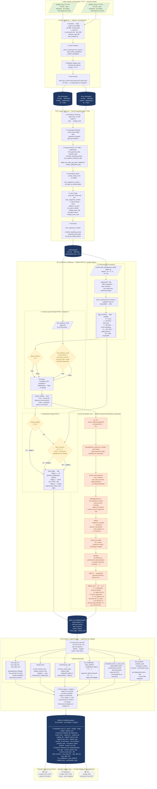

# Arquitectura del Flujo de Datos — IFRS 9 PD (Freddie Mac)

```mermaid
flowchart TD

    %% ══════════════════════════════════════════════════════════════
    %% FUENTES CRUDAS
    %% ══════════════════════════════════════════════════════════════
    subgraph SRC["📁  data_sample_year/sample_YYYY/  —  Archivos fuente"]
        OT[/"sample_orig_YYYY.txt
        32 cols · pipe-delimited · sin header
        Todo dtype=str al leer"/]

        ST[/"sample_svcg_YYYY.txt
        32 cols · pipe-delimited · sin header
        Todo dtype=str al leer"/]
    end

    %% ══════════════════════════════════════════════════════════════
    %% DATA READER
    %% ══════════════════════════════════════════════════════════════
    subgraph DR["⚙️  data_reader.py  —  Ingesta y normalización"]
        DR1["① Sentinel → NaN
        credit_score=9999 · dti=999 · ltv/cltv=999
        n_units=99 · n_borrowers=99 · eltv=999
        property_type=99 · loan_purpose=9"]

        DR2["② Cast numérico
        pd.to_numeric(errors='coerce')
        sobre ORIG_NUMERIC y PERF_NUMERIC"]

        DR3["③ Agregar vintage_year
        extraído del nombre sample_YYYY/"]

        DR4["④ pd.concat()
        2016·2017·2018·2019·2020·2022·2023·2024
        sin 2021 — no disponible en el dataset"]

        DR1 --> DR2 --> DR3 --> DR4
    end

    OT --> DR1
    ST --> DR1

    %% ══════════════════════════════════════════════════════════════
    %% PARQUETS BASE
    %% ══════════════════════════════════════════════════════════════
    OP[("orig_all.parquet
    33 cols · ~450K filas
    float64 + datetime64 + str + int64")]

    SP[("svcg_all.parquet
    33 cols · ~35M filas
    float64 + datetime64 + str + int64")]

    DR4 --> OP
    DR4 --> SP

    %% ══════════════════════════════════════════════════════════════
    %% 01 CARGA — PANEL LONGITUDINAL
    %% ══════════════════════════════════════════════════════════════
    subgraph C1["⚙️  01_carga_datos.py  —  Panel longitudinal loan × mes"]
        C1A["① Normalizar columnas
        regex strip _V# del reader R
        year → vintage_year"]

        C1B["② 2a pasada sentinels
        credit_score=9999 → NaN
        garantía si parquet viene del reader R"]

        C1C["③ Parsear fechas YYYYMM → datetime64
        first_payment_date · maturity_date
        monthly_reporting_period · zero_balance_effective_date
        ddlpi_due_date_last_paid_installment · defect_settlement_date"]

        C1D["④ Normalizar claves
        postal_code3_trunc → str.zfill(5)
        loan_sequence_number → str.strip() en ambas tablas"]

        C1E["⑤ LEFT JOIN
        svcg LEFT JOIN orig
        ON loan_sequence_number
        → 1 fila por (loan × mes)
        suffixes: col_perf · col_orig si colisión
        vintage_year_orig prevalece sobre vintage_year_svcg"]

        C1F["⑥ Sort ASC
        loan_sequence_number
        + monthly_reporting_period
        requerido para todas las ops de rolling window"]

        C1A --> C1B --> C1C --> C1D --> C1E --> C1F
    end

    OP --> C1A
    SP --> C1A

    PAN[("panel.parquet
    ~64 cols · ~35M filas
    granularidad: loan × mes")]

    C1F --> PAN

    %% ══════════════════════════════════════════════════════════════
    %% 02 DEFINICION DEFAULT — TARGET CONSTRUCTION
    %% ══════════════════════════════════════════════════════════════
    subgraph C2["⚙️  02_definicion_default.py  —  Default IFRS 9 y variable objetivo"]

        %% ── DPD ─────────────────────────────────────────────────
        subgraph DPDSUB["① Conversión DPD numérico"]
            RAW_DPD[/"current_loan_delinquency_status
            dtype=str
            valores: '0' '1' '2' '3' … 'XX' 'RA'"/]

            RA2["replace('RA', 99)
            REO Acquisition → valor numérico
            por encima del umbral de default"]

            TONUMERIC["pd.to_numeric(errors='coerce')
            cualquier valor no parseabble → NaN"]

            DPD_OUT[["dpd_numerico  ·  float  ·  nullable
            0 = al día
            1 = 30 DPD — mora leve
            2 = 60 DPD — mora moderada
            3+ = 90+ DPD — default técnico
            99 = REO Acquisition"]]

            RAW_DPD --> RA2 --> TONUMERIC --> DPD_OUT
        end

        %% ── EVENTO DEFAULT ──────────────────────────────────────
        subgraph EVTSUB["② Criterio dual de default  IFRS 9 · Basilea III"]
            DPD_GTE3{"dpd_numerico
            ≥ 3 ?"}

            ZBC_IN[/"zero_balance_code
            dtype=str
            01·02·03·06·09·..."/]

            ZBC_CHK{"zero_balance_code
            IN 02·03·09 ?
            02=venta a tercero
            03=short sale / cargo
            09=REO disposition"}

            OR_LOGIC["OR lógico
            resultado A OR resultado B
            fillna(False) — NaN → no default"]

            EVT_OUT[["evento_default  ·  bool
            True  = evento de default en este período
            False = préstamo activo o sin evento"]]

            DPD_GTE3 -->|True| OR_LOGIC
            DPD_GTE3 -->|False| OR_LOGIC
            ZBC_IN --> ZBC_CHK
            ZBC_CHK -->|True| OR_LOGIC
            ZBC_CHK -->|False| OR_LOGIC
            OR_LOGIC --> EVT_OUT
        end

        %% ── STAGE ───────────────────────────────────────────────
        subgraph STGSUB["③ Clasificación Stage IFRS 9"]
            STG_Q1{"evento_default
            = True ?"}

            STG_Q2{"dpd_numerico
            IN 1 ó 2 ?
            SICR = Incremento
            Significativo de Riesgo"}

            IFRS_STG[["ifrs9_stage  ·  Int8
            Stage 1 — sin deterioro significativo  (dpd=0)
            Stage 2 — SICR  (30 ≤ DPD < 90)
            Stage 3 — crédito deteriorado  (DPD ≥ 90 o ZBC)"]]

            STG_Q1 -->|"Sí → Stage 3"| IFRS_STG
            STG_Q1 -->|No| STG_Q2
            STG_Q2 -->|"Sí → Stage 2"| IFRS_STG
            STG_Q2 -->|"No → Stage 1"| IFRS_STG
        end

        %% ── TARGET DEFAULT_12M ──────────────────────────────────
        subgraph TGTSUB["④ 🎯  Construcción de default_12m  —  ventana forward-looking O(N) vectorizada"]
            TG1["_ev_int = evento_default.astype(int)
            convierte bool → 0/1"]

            TG2["groupby(loan_sequence_number, sort=False)
            opera dentro de cada préstamo por separado"]

            TG3["Invertir serie temporal
            x.iloc reveerse
            truco para convertir rolling lookback
            en rolling lookahead"]

            TG4["rolling(window=12, min_periods=1).max()
            sobre la serie invertida
            captura el máximo evento en una ventana de 12p"]

            TG5["shift(1)
            desplaza 1 período
            → excluye el período t (presente)
            → solo captura t+1 … t+12 (futuro)"]

            TG6["Invertir de vuelta
            iloc reverse
            restaura el orden cronológico original"]

            TG7["fillna(0)
            los últimos 12 períodos de cada préstamo
            no tienen horizonte completo → 0"]

            TG8["clip(0, 1)  ·  astype(int)
            garantiza dominio binario {0,1}"]

            DEF12M[["default_12m  ·  int  ·  0 / 1
            1 = el préstamo entra en default
                en alguno de los 12 meses siguientes
            0 = sin default en el horizonte de 12 meses
            ⚠ los últimos 12 obs de cada préstamo = 0 por construcción"]]

            TG1 --> TG2 --> TG3 --> TG4 --> TG5 --> TG6 --> TG7 --> TG8 --> DEF12M
        end

        DPD_OUT --> DPD_GTE3
        DPD_OUT --> STG_Q2
        EVT_OUT --> STG_Q1
        EVT_OUT --> TG1
    end

    PAN --> RAW_DPD
    PAN --> ZBC_IN

    PANDEF[("panel_con_default.parquet
    panel original + 4 columnas nuevas
    dpd_numerico · evento_default
    ifrs9_stage · default_12m")]

    IFRS_STG --> PANDEF
    DEF12M  --> PANDEF

    %% ══════════════════════════════════════════════════════════════
    %% 03 FEATURE ENGINEERING
    %% ══════════════════════════════════════════════════════════════
    subgraph C3["⚙️  03_feature_engineering.py  —  Ingeniería de variables"]

        F0["① Proyección columnar
        lee solo 26 de ~64 cols con pyarrow
        float64 → float32  ahorra ~50% RAM"]

        subgraph FEAT_GRP["Features derivadas"]
            FR[["max_dpd_3m · max_dpd_6m · max_dpd_12m
            groupby(loan).rolling(w, min_periods=1).max()
            ventana lookback sobre dpd_numerico"]]

            FT[["spread_tasa
            current_interest_rate − original_interest_rate
            negativo → tasa reducida por modificación"]]

            FU[["amortizacion_upb
            1 − (current_actual_upb / original_upb)
            replace(0, NaN) en denominador · clip(0,1)"]]

            FF[["fue_modificado · tiene_deferral
            modification_flag IN Y·P → 1
            payment_deferral_flag IN Y·P → 1
            dtype Int8 nullable"]]

            FE[["estimated_loan_to_value_eltv
            replace(999, NaN) — sentinel desconocido
            NaN estructural antes abr-2017
            sin imputación en este paso"]]

            FC[["loan_purpose · property_type
            occupancy_status · channel · amortization_type
            pd.Categorical.codes → int8
            -1 para NaN originales"]]
        end

        FILT["② Filtrar Stage 1 y Stage 2
        Stage 3 se excluye:
        • ya está en default → target=1 trivialmente
        • ECL Stage 3 = LGD × EAD directo en IFRS 9
        • no aporta información predictiva al modelo PD"]

        F0 --> FR
        F0 --> FT
        F0 --> FU
        F0 --> FF
        F0 --> FE
        F0 --> FC
        FR --> FILT
        FT --> FILT
        FU --> FILT
        FF --> FILT
        FE --> FILT
        FC --> FILT
    end

    PANDEF --> F0

    DMOD[("dataset_modelado.parquet
    30 columnas · solo Stage 1 y Stage 2
    ─────────────────────────────────────
    4 metadatos: loan_id · fecha · vintage · stage
    1 target:  default_12m
    13 features estáticas de originación:
       credit_score · original_ltv · original_cltv
       original_dti · original_interest_rate
       original_loan_term · original_upb
       number_of_borrowers · loan_purpose
       property_type · occupancy_status
       channel · number_of_units
    12 features dinámicas de comportamiento:
       loan_age · current_interest_rate
       current_actual_upb · eltv
       dpd_numerico · max_dpd_3m · max_dpd_6m · max_dpd_12m
       fue_modificado · tiene_deferral
       spread_tasa · amortizacion_upb")]

    FILT --> DMOD

    %% ══════════════════════════════════════════════════════════════
    %% PARTICIÓN TEMPORAL
    %% ══════════════════════════════════════════════════════════════
    subgraph PART["Partición temporal out-of-time  —  groupby vintage_year  —  sin data leakage entre particiones"]
        direction LR
        TRAIN(["🟦 Train
        vintages 2016–2020
        ajuste del modelo"])

        VALID(["🟨 Validación
        vintages 2022–2023
        tuning · early stopping"])

        TEST(["🟥 Test
        vintage 2024
        evaluación final OOT"])
    end

    DMOD --> TRAIN
    DMOD --> VALID
    DMOD --> TEST

    %% ══════════════════════════════════════════════════════════════
    %% ESTILOS
    %% ══════════════════════════════════════════════════════════════
    classDef parquet  fill:#1f3864,color:#fff,stroke:#0d2137,rx:6
    classDef proceso  fill:#dce6f1,color:#1f3864,stroke:#4472c4
    classDef rawfile  fill:#e2efda,color:#375623,stroke:#70ad47
    classDef target   fill:#fce4d6,color:#843c0c,stroke:#f4b183,stroke-width:2px
    classDef decision fill:#fff2cc,color:#7f6000,stroke:#ffc000
    classDef partition fill:#f2f2f2,color:#404040,stroke:#bfbfbf

    class OP,SP,PAN,PANDEF,DMOD parquet
    class OT,ST rawfile
    class DEF12M,TG1,TG2,TG3,TG4,TG5,TG6,TG7,TG8 target
    class DPD_GTE3,ZBC_CHK,STG_Q1,STG_Q2 decision
    class TRAIN,VALID,TEST partition
```
